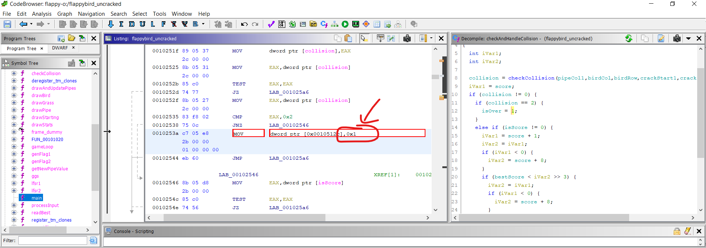

# 3. flappy-o, flappy-o2
> Author: Wong Chee Hong

This challenge was an interesting test of reverse engineering skills. We are given a binary for a command line version of flappybird. The flag for `flappy-o` is given character-by-character each time the player earns a point. To get the full flag, we have to get 64 points.

Obviously, we aren't going to sit around to get 64 points for flappybird, so we could hack the game such that it gives us some highscore, which would hopefully print the flag out.

We can disassemble the binary in Ghidra, and perform [patching](https://www.youtube.com/watch?v=8U6JOQnOOkg) to change the control flow and logic of the program. 

To begin making sense of the disassembly, we first look at the **symbol tree** for any interesting symbols. Symbols are additional information bundled in the binary for debugging, and are labels to certain routines, imports and exports in the assembly code. You can see the symbol tree window by clicking `Window > Symbol Trees` if it is not already on the screen.


Under the function tab, we can see that there are some interesting functions such as `drawBird`, `drawGrass`, `checkCollision` and `main`, etc.


Going into `main`, we can see in the `decompile` window a decompiled version of the assembly code. While the decompiled version is not the actual source code, it offers us a human readable code so that we can make sense of it. As usual, you can load this window by clicking on `Window > decompile : main`, if it is not already on the screen.


We can see that there is a bunch of initialization code, and interestingly a `gameloop()` function. For those familiar with programming a game, game loop is the overall flow control for the entire game program. See CS50 lecture on youtube for introductory explaination to game loops.

Going into the gameloop function, we see these things are done in each game loop:

```c
void gameLoop(void)

{
  while (isOver == 0) {
    clear();
    processInput();
    drawBird();
    drawStats();
    drawAndUpdatePipes();
    drawGrass();
    checkAndHandleCollision();
    updatePipeIfNeeded();
    updateAndDrawFlag();
    isScore = isScore + 1;
    pipeCounter = pipeCounter + -1;
    refresh();
    usleep(wait_duration);
  }
  return;
}
```

We can deduce that `isOver`, `isScore` and `pipeCounter` are likely shared variables. 

At this point, we have many options to hack the game such that it gives us a high score. We could for instance 
1. make the score increment by 1000 each time, or 
2. make the bird not collide with pipes and the ground, or 
3. look into `isScore` which likely determines when the next time the score is incremented.

Making the score increment by more than 1 was ruled out, since the `genFlag1` function uses the current score `n` to display which character of the flag to show.

```c
char genFlag1(int n)

{
  byte bVar1;
  ushort uVar2;
  
  bVar1 = key1[n];
  uVar2 = lfsr1(n);
  return (byte)uVar2 ^ bVar1;
}
```

We could make the game not end very easily by clicking the `isOver` variable, which would give us an idea on where the game might terminate. From Ghidra, we can see that this variable was referenced 4 times, and it is being written-to in `processInput` and `checkAndHandleCollision`.


From the `gameloop` function above, we know that the gameloop is over if `isOver` is not equal to 0. Inspecting any of these 2 functions, we see that `isOver` appears to be set to `1` if `collision == 2`. 


We can patch this by changing it such that it will be set to `0` instead, so that the game will never be over. Clicking on `isOver = 1` in the decompiled code, Ghidra highlights the relevant line in the assembly. Here, we see that `0x1` is being loaded into the address of `isOver`. Change it to `0x0` and repeat the same steps for any other places where `isOver = 1` 




We also might want to increase the rate at which the score is incremented. We can inspect the `isScore` variable, where we can see it being referenced in a few places.


In the `checkAndHandleCollision` function, we see that this is checked to decide whether or not to increment the score. 


In the same image, we see that if the value of `collision` is not `0` and not `2`, then we will check `isScore`. This means that the `checkCollision` function is key to deciding whether or not the score increases.

In the `checkCollision` function, we can edit all places in the assembly using the same technique above such that it return `1` all the time. If you spend extra time here, you will realize that the game will only increment the score if the bird is in the same column as a pipe and in the same row as the gap in the pipe.


Now, we can export this cracked version and run it. If we let the bird drop all the way to the bottom, we can see that the score is increasing at a very rapid rate, giving us the first flag.

## flappy-o2

The second flag was more tricky to get. For every 10000 points, some characters of the flag is printed. The way we got the flag was probably lucky and not the intended approach. 

What happened was that sometimes, if you run the cracked version in a terminal with a very low height, it spawns the bird under ground, which causes the game score to increase at insane rate, which allowed us to get the second flag after 30 minutes of waiting. This was unintended behavior on our part.

However, we suspect that in normal situations where the rate wasn't as fast, the game had to run some logic of rendering the bird falling down (gravity) in a game loop, which caused it to be slower. By disabling the gravity logic or spawning the bird in the ground during the initialization of `main`, it would be possible to get the score to shoot up very quickly.

However, I believe that the correct approach to this challenge part 2 was to find a code cave to insert some additional logic, to handle the incrementing the score in a more complex way. The reason was because of two linear feedback shift registers `lfsr1` and `lfsr2` used to generate the flag2.

If we incremented the score by more than 1, then the state of `lfsr1` would be incorrect, since it had to be exactly `(0 + 1 + 2 + 3 + ... + 63)` and `lfsr2` had to be exactly `10000` when the first character of flag2 is printed. The only way to ensure that `lfrs1` is `0 + 1 + 2 + 3 + ... + 63` was to increment the score by 1 each time until the first flag is printed.

By incrementing the score by more than 1 from the very beginning, it would be impossible to get the value of `lfsr1` to be `0 + 1 + 2 + 3 + ... + 63`. So, the correct way seems to be incrementing the score by 1 up until the first flag is printed, then we can increment the score such that the score will hit multiples of 10000 to generate the second flag. 

You will need to render the `report_cheater` function invalid as well, simply by changing some of the branch conditions in the code.


